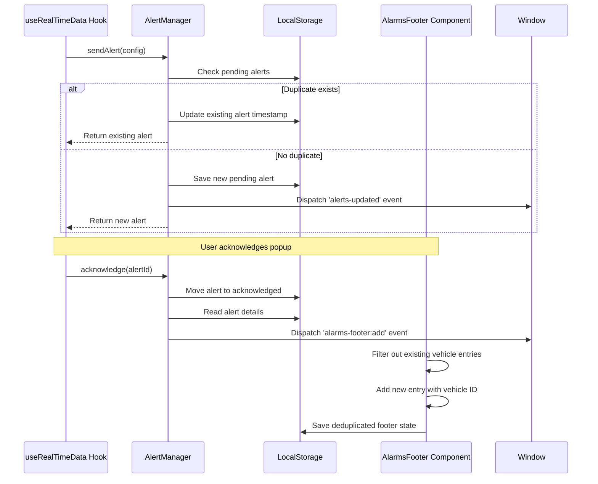

# Design Document: Fix Duplicate Vehicle Alerts

## Overview

This design addresses the duplicate alert message bug in the vehicle tracking system. The root cause is insufficient deduplication logic in both the AlertManager and the AlarmsFooter component. When alerts are acknowledged, multiple entries appear in the footer because:

1. The AlertManager's deduplication only checks for recent alerts within a 2-minute window but doesn't properly handle the case where a pending alert already exists for the same vehicle+stage
2. The AlarmsFooter component has deduplication logic in its initial state loading but not in the event handler that processes new acknowledged alerts
3. The footer entry ID is generated using timestamp+random, making it impossible to replace existing entries for the same vehicle

The solution involves:
- Strengthening the AlertManager's deduplication to update existing pending alerts instead of creating new ones
- Ensuring the AlarmsFooter component deduplicates by vehicle registration number in all code paths
- Using vehicle registration number as the stable ID for footer entries to enable replacement
- Preserving the original alert timestamp through the acknowledgment flow

## Architecture

### Component Interaction Flow



### Data Flow

1. **Alert Creation**: useRealTimeData → AlertManager.sendAlert() → localStorage (pending)
2. **Deduplication Check**: AlertManager checks pending + history for vehicle+stage match
3. **Alert Acknowledgment**: User clicks popup → AlertManager.acknowledge() → localStorage (acknowledged)
4. **Footer Update**: AlertManager dispatches custom event → AlarmsFooter filters duplicates → localStorage (footer)

## Components and Interfaces

### AlertManager (src/utils/alerts.ts)

**Purpose**: Centralized alert management with deduplication logic

**Key Methods**:

```typescript
interface AlertManager {
  // Create or update an alert with deduplication
  sendAlert(config: AlertConfig): Promise<StoredAlert | null>
  
  // Acknowledge an alert and trigger footer display
  acknowledge(id: string): boolean
  
  // Query methods
  listPending(): StoredAlert[]
  listAcknowledged(): StoredAlert[]
  listHistory(): StoredAlert[]
}
```

**Deduplication Strategy**:
- Check pending alerts for exact vehicle+stage match
- If match found, update timestamp and return existing alert
- Check history for recent (2-minute window) vehicle+stage match
- If recent match found, suppress new alert creation
- Otherwise, move current pending to history and create new pending alert

**Changes Required**:
1. Modify `sendAlert()` to update existing pending alerts instead of moving them to history
2. Ensure the vehicle registration number is used as the footer entry ID
3. Preserve original timestamp through acknowledgment flow

### AlarmsFooter Component (src/components/AlarmsFooter.tsx)

**Purpose**: Display acknowledged alerts in the footer with deduplication

**Key State**:

```typescript
interface Alarm {
  id: string | number;  // Should be vehicle registration number
  timestamp: string;
  severity: string;
  equipment: string;    // Vehicle registration number
  type: string;         // Stage name
  message?: string;     // Formatted message
  description: string;
  value: string;
  threshold: string;
  status: string;
}
```

**Deduplication Strategy**:
- On initial load: deduplicate by equipment field (vehicle reg no)
- On custom event: filter out previous entries matching the vehicle reg no
- Use vehicle reg no as the stable ID for all footer entries

**Changes Required**:
1. Ensure custom event handler deduplicates before adding new entry
2. Extract vehicle reg no from both equipment field and message text
3. Maintain deduplication across all code paths

### useRealTimeData Hook (src/hooks/useRealTimeData.ts)

**Purpose**: Trigger alerts on app restart for special vehicle

**Current Behavior**:
- Lines 223-236: Creates alert for vehicle MH12AB4829 on app restart
- Uses serverRestartToken or sessionStorage to prevent duplicates within session

**Changes Required**:
- No changes needed - the deduplication logic in AlertManager will handle this
- The existing token-based approach prevents multiple calls to sendAlert()

## Data Models

### AlertConfig

```typescript
interface AlertConfig {
  vehicleRegNo: string;      // Vehicle registration number (e.g., "MH12AB4829")
  stage: string;             // Stage name (e.g., "Reporting", "Gate Exit")
  waitTime: number;          // Wait time in minutes
  standardTime: number;      // Standard time threshold
  exceedanceRatio: number;   // Ratio of wait time to standard time
  alertLevel: 'warning' | 'critical' | 'info';
  timestamp: Date;           // Original alert creation time
  recipients: string[];      // Alert recipients (email, SMS, etc.)
}
```

### StoredAlert

```typescript
type StoredAlert = AlertConfig & {
  id: string;                // Unique alert ID (timestamp-random)
  message: string;           // Formatted alert message
  acknowledged?: boolean;    // Acknowledgment status
}
```

### Alarm (Footer Entry)

```typescript
interface Alarm {
  id: string | number;       // Vehicle registration number (stable ID)
  timestamp: string;         // ISO timestamp string
  severity: string;          // 'High', 'Medium', 'Info'
  equipment: string;         // Vehicle registration number
  type: string;              // Stage name
  message?: string;          // Formatted display message
  description: string;       // Alert description
  value: string;             // Wait time value
  threshold: string;         // Standard time threshold
  status: string;            // 'Acknowledged', 'New', etc.
}
```

### LocalStorage Keys

```typescript
const STORAGE_KEYS = {
  PENDING: 'alerts_pending_v1',           // Pending alerts awaiting acknowledgment
  ACKNOWLEDGED: 'alerts_ack_v1',          // Acknowledged alerts
  HISTORY: 'alerts_history_v1',           // Historical alerts (for deduplication)
  FOOTER: 'alarms_footer',                // Footer display state
  RESTART_TOKEN: 'serverRestartToken',    // Server restart tracking
  SHOWN_KEY_PREFIX: 'reportingAlertShown:' // Per-restart alert tracking
}
```

## Correctness Properties

*A property is a characteristic or behavior that should hold true across all valid executions of a system—essentially, a formal statement about what the system should do. Properties serve as the bridge between human-readable specifications and machine-verifiable correctness guarantees.*


### Property 1: Pending Alert Update on Duplicate

*For any* vehicle registration number and stage name, if a pending alert exists for that vehicle+stage combination, then creating a new alert with the same vehicle+stage should update the existing alert's timestamp rather than creating a second pending alert.

**Validates: Requirements 1.2, 1.4**

### Property 2: History-Based Alert Suppression

*For any* vehicle registration number and stage name, if an alert for that vehicle+stage combination was created within the last 2 minutes and exists in history, then attempting to create a new alert with the same vehicle+stage should be suppressed and return null.

**Validates: Requirements 1.3, 1.4**

### Property 3: Footer Deduplication by Vehicle ID

*For any* footer state and any new footer entry, adding the entry should result in at most one footer entry per vehicle registration number, with the newest entry being retained.

**Validates: Requirements 2.1, 2.2, 2.4, 6.2, 6.5**

### Property 4: Footer State Persistence Deduplication

*For any* set of footer entries containing duplicates (multiple entries for the same vehicle), loading the state from localStorage and then saving it back should result in only one entry per vehicle registration number with the newest timestamp.

**Validates: Requirements 2.3, 2.5**

### Property 5: Message Format Consistency

*For any* vehicle registration number and timestamp, acknowledging an alert should produce a footer message that matches the pattern "Vehicle {regNo} has Reported at the Main Gate at {time}" where time is in 12-hour format with AM/PM.

**Validates: Requirements 3.1, 3.3**

### Property 6: Timestamp Preservation Through Acknowledgment

*For any* alert with a creation timestamp, acknowledging that alert should produce a footer entry where the timestamp field equals the original alert creation timestamp.

**Validates: Requirements 3.2, 3.5**

### Property 7: Alert Lifecycle Transition

*For any* pending alert, acknowledging it should result in: (1) the alert being removed from the pending collection, (2) the alert being added to the acknowledged collection with acknowledged flag set to true, and (3) a custom event being dispatched with the formatted footer message.

**Validates: Requirements 4.2, 4.3, 4.4**

### Property 8: Vehicle ID Extraction and Usage

*For any* alert acknowledgment, the resulting footer entry ID should equal the vehicle registration number extracted from either the equipment field or the message text.

**Validates: Requirements 6.1, 6.3, 6.4**

### Property 9: Restart Token Alert Suppression

*For any* server restart token, if the special vehicle alert has already been shown for that token (tracked in localStorage), then initializing the application again with the same token should not create a new alert for the special vehicle.

**Validates: Requirements 5.2, 5.3**

## Error Handling

### Alert Creation Errors

**Scenario**: localStorage is full or unavailable

**Handling**:
- Wrap all localStorage operations in try-catch blocks
- Log errors to console for debugging
- Gracefully degrade: if storage fails, allow alert to be created in memory only
- Return null from sendAlert() to indicate failure

**Code Pattern**:
```typescript
try {
  localStorage.setItem(key, JSON.stringify(data));
} catch (error) {
  console.error('Failed to save alert:', error);
  return null;
}
```

### Deduplication Errors

**Scenario**: Corrupted data in localStorage (invalid JSON, missing fields)

**Handling**:
- Wrap JSON.parse() in try-catch blocks
- Return empty arrays/objects as fallback
- Log corruption for debugging
- Continue with deduplication using available valid data

**Code Pattern**:
```typescript
function readJSON<T>(key: string): T | null {
  try {
    const raw = localStorage.getItem(key);
    return raw ? JSON.parse(raw) as T : null;
  } catch {
    console.error(`Failed to parse ${key}`);
    return null;
  }
}
```

### Footer Event Errors

**Scenario**: Custom event dispatch fails or event detail is malformed

**Handling**:
- Validate event detail structure before processing
- Use optional chaining and nullish coalescing for safe property access
- Extract vehicle reg no with fallback logic (equipment field → message parsing → empty string)
- Continue processing other events even if one fails

**Code Pattern**:
```typescript
const handler = (e: Event) => {
  const custom = e as CustomEvent<Alarm>;
  if (!custom?.detail) return;
  
  const regNo = String(
    custom.detail.equipment || 
    custom.detail.message?.match(/Vehicle\s+(\S+)/)?.[1] || 
    ''
  );
  
  if (!regNo) {
    console.warn('Could not extract vehicle reg no from event');
    return;
  }
  
  // Process event...
};
```

### Timestamp Errors

**Scenario**: Invalid timestamp format or Date parsing failure

**Handling**:
- Validate timestamp before formatting
- Use fallback to current time if parsing fails
- Log invalid timestamps for debugging
- Ensure formatted output always includes valid time string

**Code Pattern**:
```typescript
try {
  const ts = new Date(item.timestamp);
  if (isNaN(ts.getTime())) {
    console.warn('Invalid timestamp, using current time');
    ts = new Date();
  }
  const timeStr = ts.toLocaleTimeString('en-US', { 
    hour: 'numeric', 
    minute: '2-digit' 
  });
} catch (error) {
  console.error('Timestamp formatting error:', error);
  const timeStr = new Date().toLocaleTimeString('en-US', { 
    hour: 'numeric', 
    minute: '2-digit' 
  });
}
```

## Testing Strategy

### Dual Testing Approach

This feature requires both unit tests and property-based tests to ensure comprehensive coverage:

- **Unit tests**: Verify specific examples, edge cases, and error conditions
- **Property tests**: Verify universal properties across all inputs

Both testing approaches are complementary and necessary. Unit tests catch concrete bugs in specific scenarios, while property tests verify general correctness across a wide range of inputs.

### Property-Based Testing

**Library**: We will use **fast-check** for TypeScript property-based testing.

**Configuration**:
- Each property test must run a minimum of 100 iterations
- Each test must include a comment tag referencing the design property
- Tag format: `// Feature: fix-duplicate-vehicle-alerts, Property N: [property description]`

**Test Organization**:
```
tests/
  alerts/
    alertManager.property.test.ts    # Properties 1, 2, 7, 9
    alertManager.unit.test.ts        # Edge cases and examples
  components/
    alarmsFooter.property.test.ts    # Properties 3, 4, 8
    alarmsFooter.unit.test.ts        # Edge cases and examples
  integration/
    alertFlow.property.test.ts       # Properties 5, 6
    alertFlow.unit.test.ts           # End-to-end scenarios
```

### Unit Testing Focus

Unit tests should focus on:
- **Specific examples**: Test the exact scenario from the bug report (MH12AB4829 alert)
- **Edge cases**: Empty vehicle reg no, missing timestamps, corrupted localStorage
- **Error conditions**: localStorage full, invalid JSON, missing fields
- **Integration points**: Event dispatching, localStorage synchronization

Avoid writing too many unit tests for scenarios that property tests already cover. For example, don't write 10 unit tests for different vehicle registration numbers - one property test with 100 iterations covers that comprehensively.

### Property Test Examples

**Property 1: Pending Alert Update**
```typescript
// Feature: fix-duplicate-vehicle-alerts, Property 1: Pending Alert Update on Duplicate
it('should update existing pending alert instead of creating duplicate', () => {
  fc.assert(
    fc.property(
      fc.string({ minLength: 5, maxLength: 15 }), // vehicle reg no
      fc.constantFrom('Reporting', 'Gate Exit', 'Tare Weight'), // stage
      fc.date(), // timestamp1
      fc.date(), // timestamp2
      (regNo, stage, ts1, ts2) => {
        // Create first alert
        const alert1 = AlertManager.sendAlert({
          vehicleRegNo: regNo,
          stage,
          timestamp: ts1,
          // ... other fields
        });
        
        // Attempt to create duplicate
        const alert2 = AlertManager.sendAlert({
          vehicleRegNo: regNo,
          stage,
          timestamp: ts2,
          // ... other fields
        });
        
        // Should return same alert with updated timestamp
        const pending = AlertManager.listPending();
        expect(pending).toHaveLength(1);
        expect(pending[0].vehicleRegNo).toBe(regNo);
        expect(pending[0].stage).toBe(stage);
        expect(pending[0].timestamp).toEqual(ts2);
      }
    ),
    { numRuns: 100 }
  );
});
```

**Property 3: Footer Deduplication**
```typescript
// Feature: fix-duplicate-vehicle-alerts, Property 3: Footer Deduplication by Vehicle ID
it('should maintain only one entry per vehicle in footer', () => {
  fc.assert(
    fc.property(
      fc.array(fc.record({
        id: fc.string(),
        equipment: fc.string({ minLength: 5, maxLength: 15 }),
        timestamp: fc.date().map(d => d.toISOString()),
        // ... other fields
      }), { minLength: 1, maxLength: 20 }),
      (entries) => {
        // Add all entries to footer
        entries.forEach(entry => {
          window.dispatchEvent(
            new CustomEvent('alarms-footer:add', { detail: entry })
          );
        });
        
        // Get footer state
        const footerState = JSON.parse(
          localStorage.getItem('alarms_footer') || '[]'
        );
        
        // Count entries per vehicle
        const vehicleCounts = new Map<string, number>();
        footerState.forEach((entry: any) => {
          const count = vehicleCounts.get(entry.equipment) || 0;
          vehicleCounts.set(entry.equipment, count + 1);
        });
        
        // Each vehicle should appear at most once
        vehicleCounts.forEach(count => {
          expect(count).toBeLessThanOrEqual(1);
        });
      }
    ),
    { numRuns: 100 }
  );
});
```

### Unit Test Examples

**Specific Bug Scenario**:
```typescript
describe('MH12AB4829 duplicate alert bug', () => {
  it('should show only one footer message after acknowledging alert', () => {
    // Simulate app restart
    localStorage.setItem('serverRestartToken', 'test-token-123');
    
    // Trigger alert creation
    const alert = AlertManager.sendAlert({
      vehicleRegNo: 'MH12AB4829',
      stage: 'Reporting',
      waitTime: 0,
      standardTime: 0,
      exceedanceRatio: 0,
      alertLevel: 'info',
      timestamp: new Date('2024-01-15T08:00:00'),
      recipients: []
    });
    
    // Acknowledge alert
    AlertManager.acknowledge(alert.id);
    
    // Check footer state
    const footerState = JSON.parse(
      localStorage.getItem('alarms_footer') || '[]'
    );
    
    // Should have exactly one entry for MH12AB4829
    const mh12Entries = footerState.filter(
      (e: any) => e.equipment === 'MH12AB4829'
    );
    expect(mh12Entries).toHaveLength(1);
    
    // Should have correct message format
    expect(mh12Entries[0].message).toBe(
      'Vehicle MH12AB4829 has Reported at the Main Gate at 8:00 AM'
    );
  });
});
```

**Edge Case: Corrupted localStorage**:
```typescript
describe('Error handling', () => {
  it('should handle corrupted localStorage gracefully', () => {
    // Corrupt the pending alerts data
    localStorage.setItem('alerts_pending_v1', 'invalid json{{{');
    
    // Should not throw error
    expect(() => {
      AlertManager.sendAlert({
        vehicleRegNo: 'TEST123',
        stage: 'Reporting',
        // ... other fields
      });
    }).not.toThrow();
    
    // Should still create alert
    const pending = AlertManager.listPending();
    expect(pending.length).toBeGreaterThan(0);
  });
});
```

### Test Coverage Goals

- **Line coverage**: > 90% for AlertManager and AlarmsFooter
- **Branch coverage**: > 85% for deduplication logic
- **Property tests**: All 9 properties must have corresponding tests
- **Unit tests**: All edge cases and error conditions must be covered
- **Integration tests**: End-to-end alert flow from creation to footer display

### Continuous Integration

- Run all tests on every commit
- Fail build if any property test fails
- Fail build if coverage drops below thresholds
- Run property tests with increased iterations (500+) in CI for more thorough validation
