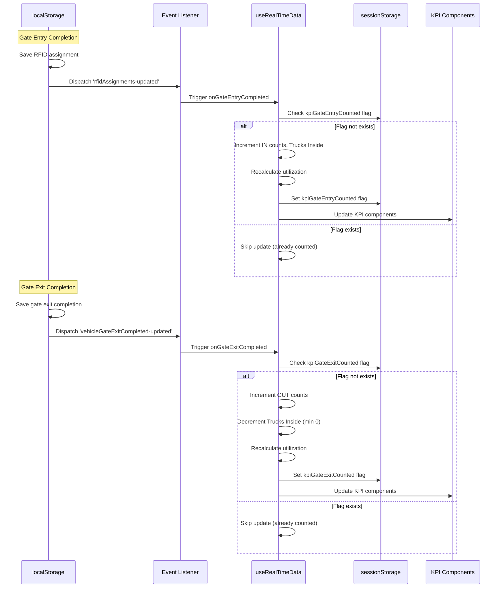

# Design Document: Real-Time KPI Updates

## Overview

This design specifies the implementation of real-time KPI updates for the TTMS dashboard. The system will automatically update the Capacity Utilization and Vehicle Summary KPI cards when vehicle MH12AB4829 completes gate entry or gate exit stages. Updates will be event-driven using localStorage events and will include safeguards against double-counting across page refreshes.

The implementation leverages the existing `useRealTimeData` hook architecture, which already contains event listeners for `rfidAssignments-updated` and `vehicleGateExitCompleted-updated` events. The current implementation has KPI update logic that needs verification and potential fixes to ensure it meets all requirements.

## Architecture

### Component Structure

```
Dashboard Page
├── useRealTimeData Hook (state management)
│   ├── KPI State (kpiData)
│   ├── Event Listeners
│   │   ├── rfidAssignments-updated
│   │   └── vehicleGateExitCompleted-updated
│   └── Initial Reconciliation Logic
├── CapacityUtilizationKPI Component
│   ├── Utilization Percentage Display
│   ├── Plant Capacity Display
│   └── Trucks Inside Display
└── Vehicle Summary KPI Component
    ├── Vehicles IN (Day) Display
    ├── Vehicles OUT (Day) Display
    ├── Vehicles IN (Cum) Display
    └── Vehicles OUT (Cum) Display
```

### Data Flow



## Components and Interfaces

### useRealTimeData Hook

**Purpose**: Manages KPI state and handles real-time updates via event listeners.

**State Structure**:
```typescript
interface KPIData {
  capacity: {
    utilization: number          // Percentage (0-100)
    plantCapacity: number         // Maximum trucks
    trucksInside: number          // Current trucks in plant
    trend: TrendData
  }
  vehicles: {
    inDay: number                 // Vehicles entered today
    outDay: number                // Vehicles exited today
    inCum: number                 // Cumulative vehicles entered
    outCum: number                // Cumulative vehicles exited
    trend: TrendData
    target: number
  }
  // ... other KPI data
}
```

**Event Handlers**:

1. **onGateEntryCompleted**
   - Triggered by: `rfidAssignments-updated` event
   - Checks: sessionStorage for `kpiGateEntryCounted:MH12AB4829`
   - Updates:
     - `vehicles.inDay += 1`
     - `vehicles.inCum += 1`
     - `capacity.trucksInside += 1`
     - `capacity.utilization = Math.round((trucksInside / plantCapacity) * 100)`
   - Persists: `kpiGateEntryCounted:MH12AB4829` flag in sessionStorage

2. **onGateExitCompleted**
   - Triggered by: `vehicleGateExitCompleted-updated` event
   - Checks: sessionStorage for `kpiGateExitCounted:MH12AB4829`
   - Updates:
     - `vehicles.outDay += 1`
     - `vehicles.outCum += 1`
     - `capacity.trucksInside = Math.max(0, trucksInside - 1)`
     - `capacity.utilization = Math.round((trucksInside / plantCapacity) * 100)`
   - Persists: `kpiGateExitCounted:MH12AB4829` flag in sessionStorage

3. **ensureInitialKpiCounts** (Reconciliation)
   - Triggered by: Dashboard initialization (useEffect)
   - Reads: All RFID assignments and gate exit completions from localStorage
   - For each vehicle without a sessionStorage flag:
     - Apply corresponding KPI updates
     - Set sessionStorage flag
   - Purpose: Ensure KPI counts reflect already-completed stages on page load

### KPI Components

**CapacityUtilizationKPI**:
- Receives `data.utilization`, `data.plantCapacity`, `data.trucksInside` as props
- Displays utilization percentage with color-coded status (green/yellow/red)
- Re-renders automatically when `kpiData.capacity` changes

**VehicleSummaryKPI**:
- Receives `data.inDay`, `data.outDay`, `data.inCum`, `data.outCum` as props
- Displays vehicle counts in a grid layout
- Re-renders automatically when `kpiData.vehicles` changes

## Data Models

### localStorage Keys

```typescript
// RFID Assignments (Gate Entry)
'vehicleRfidAssignments': Record<string, string>
// Example: { "MH12AB4829": "RFID-1001" }

// Gate Exit Completions
'vehicleGateExitCompleted': Record<string, string>
// Example: { "MH12AB4829": "GE-1" }
```

### sessionStorage Keys

```typescript
// Gate Entry Counting Flags
'kpiGateEntryCounted:MH12AB4829': '1'

// Gate Exit Counting Flags
'kpiGateExitCounted:MH12AB4829': '1'
```

### Event Names

```typescript
// Dispatched when RFID assignment is saved
'rfidAssignments-updated'

// Dispatched when gate exit completion is saved
'vehicleGateExitCompleted-updated'
```

## Correctness Properties

*A property is a characteristic or behavior that should hold true across all valid executions of a system—essentially, a formal statement about what the system should do. Properties serve as the bridge between human-readable specifications and machine-verifiable correctness guarantees.*

### Property Reflection

After analyzing the acceptance criteria, several properties can be combined to eliminate redundancy:

- Utilization calculation (1.2 and 2.2) → Single property for calculation formula
- SessionStorage persistence (1.5 and 2.5) → Single property for flag persistence pattern
- Event dispatching (3.1 and 3.2) → Single property for localStorage event pattern
- Event listeners (3.3 and 3.4) → Single property for event handling
- localStorage reading (5.1 and 5.2) → Single property for initialization reading
- Reconciliation (5.3 and 5.4) → Single property for applying updates
- Component re-rendering (8.3 and 8.4) → Single property for React updates

### Core Properties

**Property 1: Gate Entry Increments Counters**
*For any* initial KPI state, when gate entry completes for MH12AB4829, the Trucks Inside count should increase by exactly 1, Vehicles IN (Day) should increase by exactly 1, and Vehicles IN (Cum) should increase by exactly 1.
**Validates: Requirements 1.1, 1.3, 1.4**

**Property 2: Gate Exit Increments OUT and Decrements IN**
*For any* initial KPI state, when gate exit completes for MH12AB4829, the Trucks Inside count should decrease by exactly 1 (minimum 0), Vehicles OUT (Day) should increase by exactly 1, and Vehicles OUT (Cum) should increase by exactly 1.
**Validates: Requirements 2.1, 2.3, 2.4**

**Property 3: Utilization Calculation Correctness**
*For any* values of Trucks Inside and Plant Capacity, the utilization percentage should equal Math.round((trucksInside / Math.max(1, plantCapacity)) * 100), ensuring division by zero is prevented and the result is rounded to the nearest integer.
**Validates: Requirements 1.2, 2.2, 7.1, 7.2, 7.3**

**Property 4: Utilization Recalculates on Truck Count Change**
*For any* KPI state, when Trucks Inside changes (via gate entry or exit), the utilization percentage should be immediately recalculated using the correct formula.
**Validates: Requirements 7.4**

**Property 5: SessionStorage Flag Persistence**
*For any* KPI update (gate entry or exit) for MH12AB4829, after the update completes, a corresponding flag should exist in sessionStorage with the format 'kpiGateEntryCounted:{vehicleRegNo}' or 'kpiGateExitCounted:{vehicleRegNo}'.
**Validates: Requirements 1.5, 2.5, 4.3**

**Property 6: Idempotent Updates**
*For any* vehicle, when the same stage completion event is triggered multiple times in the same session, the KPI counts should only increment once (the first time), with subsequent events being ignored due to the sessionStorage flag.
**Validates: Requirements 4.2, 6.3**

**Property 7: Event Dispatching on localStorage Write**
*For any* vehicle, when an RFID assignment or gate exit completion is saved to localStorage, the corresponding event ('rfidAssignments-updated' or 'vehicleGateExitCompleted-updated') should be dispatched.
**Validates: Requirements 3.1, 3.2**

**Property 8: Event Listeners Trigger Updates**
*For any* vehicle, when the 'rfidAssignments-updated' or 'vehicleGateExitCompleted-updated' event is dispatched, the corresponding KPI update logic should execute (subject to sessionStorage flag checks).
**Validates: Requirements 3.3, 3.4**

**Property 9: Initial Reconciliation Reads localStorage**
*For any* dashboard initialization, the system should read all RFID assignments and gate exit completions from localStorage before applying any updates.
**Validates: Requirements 5.1, 5.2**

**Property 10: Reconciliation Applies Missing Updates**
*For all* vehicles with completed stages in localStorage and no corresponding sessionStorage flag, the dashboard should apply the appropriate KPI updates and set the flags during initialization.
**Validates: Requirements 5.3, 5.4, 5.5**

**Property 11: Vehicle-Specific Flag Keys**
*For any* vehicle registration number, the sessionStorage flag key should include the vehicle registration number, ensuring different vehicles are tracked independently.
**Validates: Requirements 6.1, 6.2, 6.4**

**Property 12: Component Re-rendering on State Change**
*For any* KPI state change, the CapacityUtilizationKPI and VehicleSummaryKPI components should receive updated props and re-render to display the new values.
**Validates: Requirements 8.3, 8.4**

### Edge Cases

**Edge Case 1: Trucks Inside Never Negative**
When gate exit occurs and Trucks Inside would become negative, the count should be set to 0 instead.
**Validates: Requirements 2.6**

**Edge Case 2: Zero Plant Capacity**
When Plant Capacity is 0, the utilization calculation should treat it as 1 to prevent division by zero.
**Validates: Requirements 7.2**

## Error Handling

### Scenarios and Responses

1. **localStorage Access Failure**
   - Scenario: Browser blocks localStorage access
   - Response: Wrap all localStorage operations in try-catch blocks, log errors, continue with default values

2. **sessionStorage Access Failure**
   - Scenario: Browser blocks sessionStorage access
   - Response: Wrap all sessionStorage operations in try-catch blocks, allow updates to proceed (may result in double-counting)

3. **Invalid Data in localStorage**
   - Scenario: Corrupted or malformed data in localStorage
   - Response: Use JSON.parse with try-catch, default to empty object on parse failure

4. **Event Listener Registration Failure**
   - Scenario: Event listener fails to attach
   - Response: Log error, system will not receive real-time updates but will reconcile on next page load

5. **State Update During Unmount**
   - Scenario: Component unmounts while async operation is pending
   - Response: Clean up event listeners in useEffect cleanup function

## Testing Strategy

### Dual Testing Approach

The testing strategy employs both unit tests and property-based tests to ensure comprehensive coverage:

- **Unit Tests**: Verify specific examples, edge cases, and integration points
- **Property Tests**: Verify universal properties across all inputs using randomization

### Property-Based Testing

**Library**: fast-check (for TypeScript/JavaScript)

**Configuration**:
- Minimum 100 iterations per property test
- Each test tagged with: `Feature: real-time-kpi-updates, Property {number}: {property_text}`

**Property Test Cases**:

1. **Test Gate Entry Increments** (Property 1)
   - Generate: Random initial KPI state
   - Action: Trigger gate entry for MH12AB4829
   - Assert: Trucks Inside += 1, Vehicles IN (Day) += 1, Vehicles IN (Cum) += 1

2. **Test Gate Exit Updates** (Property 2)
   - Generate: Random initial KPI state with trucksInside > 0
   - Action: Trigger gate exit for MH12AB4829
   - Assert: Trucks Inside -= 1, Vehicles OUT (Day) += 1, Vehicles OUT (Cum) += 1

3. **Test Utilization Calculation** (Property 3)
   - Generate: Random trucksInside (0-200), random plantCapacity (0-200)
   - Action: Calculate utilization
   - Assert: Result equals Math.round((trucksInside / Math.max(1, plantCapacity)) * 100)

4. **Test Idempotent Updates** (Property 6)
   - Generate: Random initial KPI state
   - Action: Trigger same gate entry event twice
   - Assert: Counts only increment once

5. **Test Vehicle-Specific Flags** (Property 11)
   - Generate: Random vehicle registration numbers
   - Action: Trigger updates for different vehicles
   - Assert: Each vehicle has its own sessionStorage flag

### Unit Testing

**Focus Areas**:
- Edge case: Trucks Inside never goes negative
- Edge case: Zero plant capacity handled correctly
- Example: Dashboard initialization reads localStorage
- Example: SessionStorage flag format is correct
- Integration: Event listeners properly attached and cleaned up
- Integration: React state updates trigger component re-renders

**Test Cases**:

1. **Trucks Inside Minimum Zero**
   - Setup: KPI state with trucksInside = 0
   - Action: Trigger gate exit
   - Assert: trucksInside remains 0

2. **Zero Plant Capacity**
   - Setup: KPI state with plantCapacity = 0, trucksInside = 5
   - Action: Calculate utilization
   - Assert: No division by zero error, utilization calculated with capacity = 1

3. **SessionStorage Flag Format**
   - Setup: Clean sessionStorage
   - Action: Trigger gate entry for MH12AB4829
   - Assert: sessionStorage contains key 'kpiGateEntryCounted:MH12AB4829'

4. **Event Listener Cleanup**
   - Setup: Mount useRealTimeData hook
   - Action: Unmount hook
   - Assert: Event listeners are removed

5. **Component Re-render**
   - Setup: Render CapacityUtilizationKPI with initial props
   - Action: Update KPI state
   - Assert: Component displays new values

### Integration Testing

1. **End-to-End Gate Entry Flow**
   - Save RFID assignment to localStorage
   - Verify event is dispatched
   - Verify KPI state updates
   - Verify sessionStorage flag is set
   - Verify UI components display updated values

2. **End-to-End Gate Exit Flow**
   - Save gate exit completion to localStorage
   - Verify event is dispatched
   - Verify KPI state updates
   - Verify sessionStorage flag is set
   - Verify UI components display updated values

3. **Page Refresh Reconciliation**
   - Set up localStorage with completed stages
   - Clear sessionStorage
   - Initialize dashboard
   - Verify KPI counts reflect completed stages
   - Verify sessionStorage flags are set

### Test Coverage Goals

- 100% coverage of event handler functions
- 100% coverage of utilization calculation logic
- 100% coverage of sessionStorage flag logic
- 100% coverage of edge cases (negative trucks, zero capacity)
- Property tests validate universal correctness across 100+ random inputs per property
